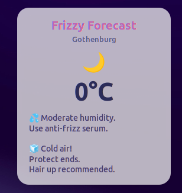

# Frizzy Forecast 


> Because your (my) hair deserves (needs) preparation.

Frizzy Forecast is a Cinnamon desklet that gives real-time hair styling advice based on current weather conditions.

Built for Linux Mint / Cinnamon using JavaScript and the Open-Meteo API.

---

## Preview




---

## Features

- Large temperature display
- Dynamic weather mood icon (sun, moon, wind, rain)
- Humidity-aware frizz warnings
- Wind styling suggestions
- Cold weather hair protection tips
- Auto-refresh every 10 minutes
- Multiple layered advice blocks when conditions overlap

---

##  Installation

### Clone the repository

```bash
git clone https://github.com/YOURUSERNAME/frizzy-forecast.git
```

### Move it to your Cinnamon desklets directory

##  Installation

### Clone the repository

```bash
git clone https://github.com/YOURUSERNAME/frizzy-forecast.git
```

### Move it to your Cinnamon desklets directory

```bash
mv frizzy-forecast/frizzyforecast@aWaithira ~/.local/share/cinnamon/desklets/
```
Make sure the folder matches the `uuid` in `metadata.json` 

### Restart Cinnamon

Press: 
```
Alt + F2
```
Type
```
r
```
Press enter


### Add the desklet
- Right click your desktop
- Select "Add Desklets"
- Choose Frizzy Forecast"

## Configuration

Default location is `Gohenburg`. To change thise edit these lines in `desklet.js`:
```
this.lat = "57.7089";
this.lon = "11.9746";
```
Find coords: https://open-meteo.com/


## Project Structure
```
frizzy-forecast/
└── frizzyforecast@aWaithira/
    ├── desklet.js
    ├── stylesheet.css
    ├── metadata.json
    ├── icon.svg
    ├── screenshot.png
    └── README.md
```

